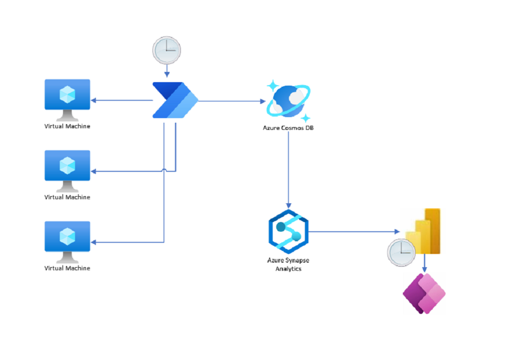

# Azure Virtual Machine Management 

This scenario provides an approach to using PowerBI, PowerApps, and Power Automate to monitor and manage your Azure Virtual Machines. While not a complete

## Design Approach

Using a scheduled Power Automate flow, we capture the current state of every VM within the Azure tenant and store it as a JSON document within CosmosDB for low-latency querying and updating.
CosmosDB provides an out of the box output for PowerBI via Azure Synapse, which allows for the easy creation of a Power BI Dashboard. Using the Power App visualization control within Power BI, the embedded Power App provides the control pane for stopping and starting the VMs.

## Scenarios
Below is a listing of the sample solutions available.  These sample solutions are meant to demonstrate patterns & possible approaches to solving specific business scenarios, and should not be used as final/production solutions.

| [Real-Time License Assign with GraphAPI](https://github.com/microsoft/GBB-Business-Applications/tree/main/demos/d365-realtime-license-assign)

| [Pega Migration to Dataverse](https://github.com/microsoft/GBB-Business-Applications/tree/main/demos/migration-pega-to-d365)

## Resources
- [Dataverse developer docs](https://learn.microsoft.com/power-apps/developer/data-platform/)
- [Model-driven apps developer docs](https://learn.microsoft.com/power-apps/developer/model-driven-apps/)
- [Canvas apps developer docs](https://learn.microsoft.com/power-apps/maker/canvas-apps/dev-enterprise-intro)
- [Power Apps component framework docs](https://learn.microsoft.com/power-apps/developer/component-framework/overview)
- [Power Platform developer docs](https://learn.microsoft.com/power-platform/developer)

## Contributing

This project welcomes contributions and suggestions.  Most contributions require you to agree to a
Contributor License Agreement (CLA) declaring that you have the right to, and actually do, grant us
the rights to use your contribution. For details, visit https://cla.microsoft.com.

When you submit a pull request, a CLA-bot will automatically determine whether you need to provide
a CLA and decorate the PR appropriately (e.g., label, comment). Simply follow the instructions
provided by the bot. You will only need to do this once across all repos using our CLA.

This project has adopted the [Microsoft Open Source Code of Conduct](https://opensource.microsoft.com/codeofconduct/).
For more information see the [Code of Conduct FAQ](https://opensource.microsoft.com/codeofconduct/faq/) or
contact [opencode@microsoft.com](mailto:opencode@microsoft.com) with any additional questions or comments.
